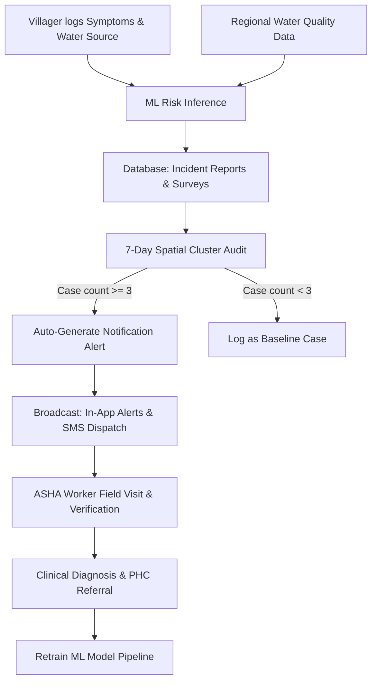

# Community-Based Early Warning System (EWS) for Water-Borne Diseases
## Comprehensive Project Documentation & Technical Report

This document details the architecture, design objectives, implementation workflow, limitations, and future enhancements of the **WaterGuard Early Warning System (EWS)**.

---

## 1. Abstract
Waterborne disease outbreaks remain a critical threat to public health in rural and peri-urban communities. Traditional disease tracking models are reactive, relying on hospital admission logs that only record cases after an epidemic has already spread. 

**WaterGuard** is a proactive, crowdsourced **Early Warning System (EWS)** designed to detect potential outbreaks before they become widespread. The system integrates crowdsourced symptom surveys, local water source monitoring, and machine learning models to identify environmental-clinical risk correlations. A spatial-temporal audit rule automatically flags clusters (3 or more cases in the same village/district within 7 days), generating high-priority notifications that are instantly dispatched to citizens and ASHA field workers. By bridging environmental parameters (pH, turbidity, dissolved oxygen) with clinical observations, WaterGuard answers the core question: *Can we detect waterborne outbreaks and warn the community before they become serious?*

---

## 2. Platform Overview: What is Going on in the Website?
The WaterGuard platform is designed around a multi-stakeholder workflow consisting of four user roles, each accessing a tailored interface to handle localized surveillance, verification, and containment.

### 2.1 Public Landing Page (Landing & First Impression)
- **Role**: Entry point for anonymous visitors and stakeholders.
- **Workflow**: Explains the 4-step EWS workflow, presents a live-updating stream of automated cluster alerts, and provides targeted dashboard entry points based on user credentials.

### 2.2 Villager / Citizen Dashboard (Community Logging & Warn Center)
- **Symptom Logging**: Citizens log localized gastrointestinal symptoms (diarrhea, vomiting, fever, abdominal pain, dehydration) along with the drinking water source used (Tap, Borewell, Tank, River).
- **Incident Reporting**: Allows citizens to submit complaints about water aesthetics (odor, discoloration, leaks).
- **Explainable Risk Assessment**: Displays a custom AI Risk Card breaking down how the machine learning model evaluates their individual risk based on input symptoms and regional physical water parameters.
- **Local Alerts & Guides**: Houses active alerts for their village/district and provides step-by-step water safety actions (e.g., boiling guidelines).
- **Persistent Emergencies**: Displays contact directories for local ASHA workers, ambulances, and Primary Health Centres (PHC).

### 2.3 ASHA Worker Dashboard (Field Verification & Referral)
- **Ground Verification**: Receives pending surveys from villagers in their district. Workers conduct home visits, submit official clinical diagnoses, and log statuses.
- **PHC Referrals**: Flags high-risk cases for immediate referral to clinical Primary Health Centres.
- **Households Care Checklist**: Interactive tracking table mapping village plots to Healthy/Symptomatic states.
- **Field Visit Logs**: Persistent audit ledger for tracking home visits, hydration recommendations, and household water sanitation checks.
- **Emergency Directory Management**: ASHA workers can update local medical numbers in real-time.

### 2.4 Health Official Dashboard (District Analytics & Broadcasts)
- **Hotspot Map**: Interactive Leaflet/OSM map visualizing regional incident clusters with pulsing alert markers.
- **EWS Analytics**: Tracks district case trend charts, symptom distributions, and water source breakdown statistics.
- **ML Anomaly Tracker**: Analyzes Gradient Boosting predictions and displays statistical risk drivers (e.g., pH anomalies or turbidity spikes) for selected districts.
- **Emergency Broadcast Center**: Allows officials to trigger manual override emergency warnings and dispatches SMS alerts directly to the directories of affected villages or districts.
- **Outbreak Simulator Sandbox**: Sandbox interface where officials adjust sliding water parameters and symptom rates to simulate risk projections.

### 2.5 Admin Dashboard (System Configuration)
- **User & Role Management**: Manages active platform users and roles.
- **ML Model Manager**: Provides retraining pipeline controls to trigger model updates (`/admin/model/retrain`) when new verified datasets are logged, displaying model accuracy metrics.

---

## 3. Introduction & Problem Statement

### 3.1 Introduction
Access to safe drinking water is a fundamental human right. However, biological contamination of water infrastructure frequently triggers outbreaks of diseases like cholera, typhoid, and gastroenteritis. In rural jurisdictions, water security is monitored through manual testing, while healthcare data is siloed inside local clinics. 

An **Early Warning System (EWS)** acts as a digital bridge between clinical symptoms and environmental hazards. By analyzing symptoms at the community level in real-time, the system detects micro-anomalies and generates localized warnings, enabling community containment before patients overwhelm clinics.

### 3.2 Problem Statement
Existing water security and healthcare systems suffer from three primary flaws:
1. **Reporting Lag**: Clinical health channels only log cases after patients visit hospitals, leading to a reporting delay of 3–7 days, by which time waterborne outbreaks are already widespread.
2. **Siloed Data**: Physical water parameters (pH, turbidity, dissolved oxygen) and health indicators (gastrointestinal symptoms) are monitored independently, hiding critical correlations.
3. **Loss of Explainability**: Standard machine learning models often use lossy preprocessing techniques (like Principal Component Analysis) that mask physical thresholds (e.g., ph deviations), making predictions hard for health officials to interpret and act on.

---

## 4. Implementation Workflow
The technical workflow is divided into five phases, coordinating data acquisition, risk assessment, automated auditing, alert routing, and validation.

### Phase 1: Community Input & Environmental Correlation
- **Input**: Citizens submit symptom surveys via the frontend client. The backend identifies the user's location and fetches the latest physical water quality records (turbidity, pH, nitrates, sulphates, DO, TSS) for their village.
- **Feature Assembly**: Raw symptoms and physical parameters are merged into a single feature vector.

### Phase 2: Machine Learning Inference (Explainable Risk)
- **Predictive Engine**: The feature vector is evaluated by an optimized **Gradient Boosting Classifier** trained directly on scaled raw parameters (no PCA).
- **Output**: Returns the risk level (`Low`, `Medium`, `High`) and a probability score.
- **Explainability Rendering**: The prediction probability and risk drivers are visualized as horizontal impact bars representing feature importances.

### Phase 3: Spatial-Temporal Cluster Auditing
- **Rule Engine**: Upon report submission, a database audit counts symptom reports submitted in the same village and district within the last 7 days.
- **Cluster Threshold**: If the rolling case count matches or exceeds **3 reports**, a cluster outbreak threat is flagged.
- **Rate Limiting**: Checks if a cluster alert was already generated for that village/district in the last 24 hours to prevent duplicate message storms.

### Phase 4: Warning Dispatch & Notification Routing
- **Notification Generation**: The system creates an automated `Notification` record detailing the cluster size and region.
- **Multi-Channel Dispatch**: 
  - **In-App alerts** are pushed to local citizen dashboards.
  - **Task alerts** are sent to regional ASHA worker queues.
  - **Simulated SMS alerts** are triggered via the notification engine to notify users in the target district.

### Phase 5: Field Action & Verification Loop
- **Ground Auditing**: ASHA workers view pending surveys, visit symptomatic households, and log clinical diagnoses.
- **Referral Execution**: If the patient exhibits severe dehydration or cholera-like symptoms, the ASHA worker triggers a PHC referral.
- **Pipeline Retraining**: Verified cases are fed back into the training data loop, allowing admins to retrain the ML model to improve predictive accuracy.

---

## 5. Limitations
While WaterGuard is highly effective, it has several limitations:
1. **Connectivity Reliance**: The crowdsourced warning pipeline requires mobile network or internet access, which can be limited in remote rural regions.
2. **False Positives**: Crowdsourced reporting can result in false reports. This is mitigated by requiring ASHA field workers to verify cases on the ground before they are officially classified as "Confirmed Outbreaks".
3. **Static Environmental Parameters**: Water quality tests are often uploaded periodically (monthly/weekly), meaning the ML model might correlate real-time symptoms with slightly outdated physical water statistics.
4. **Local Gateway Integration**: The SMS notification engine is currently simulated via mock logs and requires integration with regional cellular gateways (e.g. Twilio or national SMS pools) for physical deployments.

---

## 6. Future Enhancements
To scale the platform for regional deployments, the following upgrades are proposed:
1. **Real-time IoT Sensor Integration**: Deploy solar-powered IoT water sensors in village storage tanks to transmit continuous pH, turbidity, and chlorine metrics directly to the EWS backend.
2. **Advanced Spatial Clustering Algorithms**: Replace rule-based counts with spatial algorithms (like DBSCAN or Kriging interpolation) to model outbreak clusters across administrative borders.
3. **Speech-to-Text Multi-Lingual Reporting**: Integrate IVR (Interactive Voice Response) phone lines allowing rural citizens to report symptoms by speaking in their native dialect (e.g. Telugu).
4. **National Database Integration**: Establish API sync pipelines with national clinical networks, such as India's Integrated Disease Surveillance Program (IDSP), to share telemetry and coordinate containment protocols automatically.
